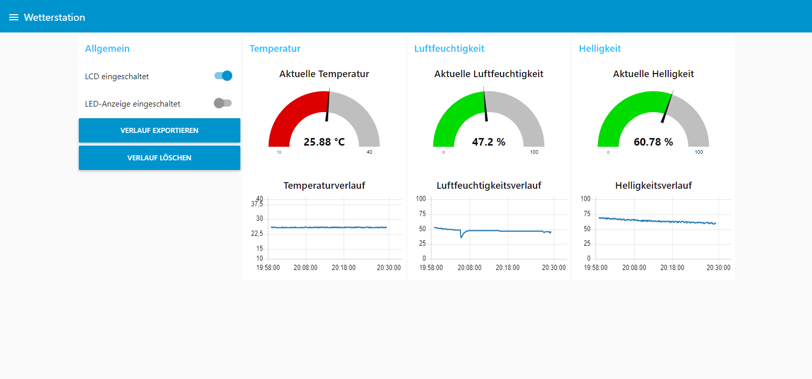
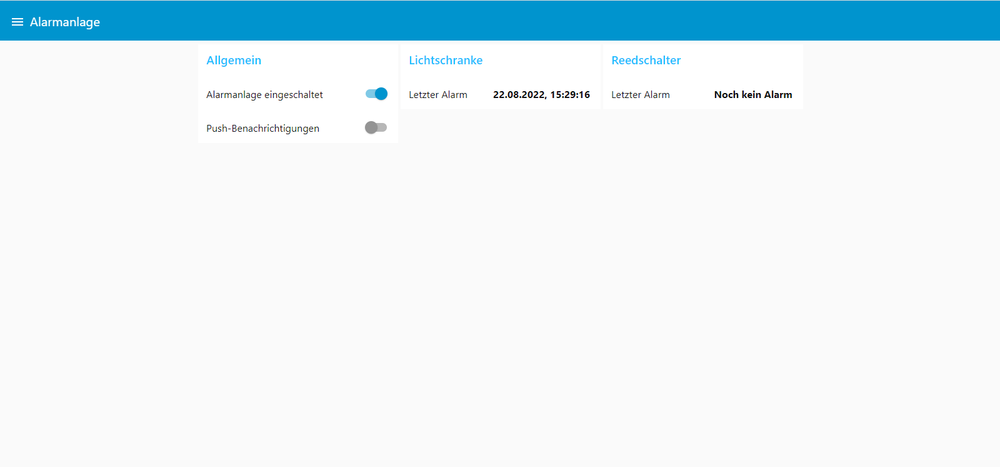

# Wetterstation und Alarmanlage

## Wetterstation

### Funktionen

Die Wetterstation läuft auf einem Raspberry Pi und misst die aktuelle Temperatur, Luftfeuchtigkeit und Helligkeit.

An die Wetterstation sind zwei lokale Anzeigen angeschlossen: ein LCD, das die aktuellen Messwerte anzeigt und ein LED-Streifen, der jeweils eine der drei Messgrößen grafisch darstellt. Mit zwei Tasten kann die Temperatureinheit auf dem LCD und die auf der LED-Anzeige dargestellte Messgröße angepasst werden.

Zusätzlich werden die Messdaten über das MQTT-Protokoll an ein [Node-RED-Dashboard](#node-red-dashboard) gesendet.

### Aufbau

Die Pin-Belegung und andere Hardware-Einstellungen (z. B. die I²C-Adresse des LCD) können über die Konstanten in der Datei `__main__.py` (Abschnitt "Peripherie") geändert werden.

Es wird die physikalische Nummerierung der Pins genutzt. I²C und die 1-Wire-Schnittstelle müssen in den Raspberry Pi-Einstellungen aktiviert werden.

| Bauteil                                            | Pin-Belegung                     |
| -------------------------------------------------- | -------------------------------- |
| LCD1602 mit I²C                                    | SDA, SCL                         |
| [LED-Anzeige](https://www.adeept.com/adeept-new-10-segment-led-bar-graph-module-for-arduino-raspberry-pi-arm-avr-dsp-pic-freeshipping-headphones-diy-diykit_p0065.html) | 38 (Data), 40 (Clock) |
| Taste zum Ändern der Temperatureinheit             | 16                               |
| Taste zum Ändern der Messgröße auf der LED-Anzeige | 35                               |
| Temperatursensor DS18B20                           | 7                                |
| Luftfeuchtigkeitssensor DHT22                      | 26                               |
| Analog-Digital-Converter ADC0832                   | 11 (CS), 12 (Data), 13 (Clock)   |
| Fotowiderstand                                     | Angeschlossen an Kanal 0 des ADC |

### Verwendete Bibliotheken

* [RPLCD](https://github.com/dbrgn/RPLCD)
* [Adafruit DHT Sensor Library](https://github.com/adafruit/Adafruit_Python_DHT)
* [RasPyADC0832](https://github.com/InvncibiltyCloak/RasPyADC0832/)
* [Paho MQTT Client](https://github.com/eclipse/paho.mqtt.python)

## Alarmanlage

### Funktionen

Die Alarmanlage läuft auf einem D1 Mini-Mikrocontroller, an dem verschiedene Sensoren angeschlossen sind, die einen Einbruch erkennen sollen. Wird ein möglicher Einbruch erkannt, wird auf einem Piezo ein Warnton ausgegeben. Außerdem wird über MQTT eine Nachricht an das [Node-RED-Dashboard](#node-red-dashboard) gesendet.

Es werden zwei Arten von Sensoren genutzt:

* Infrarot-Reflexlichtschranken, mit denen Hindernisse erkannt werden können
* Reedschalter, mit denen z. B. erkannt werden kann, ob ein Fenster geöffnet wurde

Eine Status-LED zeigt an, ob die Alarmanlage aktiv ist.

### Aufbau

Die Pin-Belegung kann über die Konstanten in der Datei `Alarmanlage.ino` geändert werden.

Möchte man zusätzliche Sensoren anschließen (z. B. einen zweiten Reedschalter), muss nur das Array `sensors` angepasst werden. Da hier mit Instanzen der abstrakten Klasse `Sensor` gearbeitet wird, können leicht neue Implementierungen für andere Sensortypen hinzugefügt werden.

| Bauteil                                               | Pin-Belegung                                          |
| ----------------------------------------------------- | ----------------------------------------------------- |
| Infrarot-Reflexlichtschranke KY-033 mit Analogausgang | A0 (digitaler Ausgang des Sensors wird nicht genutzt) |
| Reedschalter                                          | D2                                                    |
| Aktiver Piezo-Summer                                  | D1                                                    |
| Status-LED                                            | D7                                                    |

### Verwendete Bibliotheken

* [PubSubClient](https://github.com/knolleary/pubsubclient)

## Node-RED-Dashboard

Zusätzlich zu den Ausgaben am Raspberry Pi und am Mikrocontroller werden alle Daten auch über das MQTT-Protokoll an ein [Node-RED](https://nodered.org/)-Dashboard gesendet und können innerhalb des WLAN-Netzwerks über einen Webbrowser abgerufen werden.

Neben Node-RED ist dafür auch ein MQTT-Broker wie z. B. [mosquitto](https://mosquitto.org/) nötig. Beide Softwarekomponenten können z. B. auf einem Raspberry Pi ausgeführt werden. Damit die Kommunikation funktioniert, muss dessen IP-Adresse in den Dateien `__main__.py` und `Alarmanlage.ino` hinterlegt werden. In der Datei `Alarmanlage.ino` müssen zusätzlich die Zugangsdaten würde das genutzte WLAN-Netzwerk eingetragen werden.

### Wetterstation



Das Dashboard der Wetterstation zeigt die aktuellen Messwerte zusammen mit einem Verlauf an.

Im Abschnitt "Allgemein" können über zwei Schalter die lokalen Anzeigen am Raspberry Pi ausgeschaltet werden, wenn sie gerade nicht genutzt werden. Außerdem lässt sich der Verlauf als JSON-Datei exportieren oder auch löschen.

Soll der Verlauf auch bei einem Neustart von Node-RED erhalten bleiben, muss man den folgenden Abschnitt in den Node-RED-Einstellungen ergänzen:

```js
contextStorage: {
   default: {
       module: "localfilesystem"
   }
}
```

### Alarmanlage



Das Dashboard der Alarmanlage zeigt, wann ein Sensor zuletzt einen Alarm ausgelöst hat. Ist das Dashboard geöffnet, wenn gerade ein Alarm ausgelöst wird, erscheint zusätzlich ein Benachrichtigungsfenster. Außerdem hat man die Möglichkeit, die Alarmanlage abzuschalten.

Ist die Option "Push-Benachrichtigungen" aktiviert, erhält man bei einem Alarm eine Benachrichtigung auf dem Smartphone. Dafür wird die App [simplepush](https://simplepush.io/) genutzt. Diese Option ist besonders nützlich, da man die Benachrichtigung auch dann erhält, wenn man nicht mit dem Heimnetzwerk verbunden ist.

Hat man am Mikrocontroller neue Sensoren angeschlossen, muss natürlich auch die Benutzeroberfläche angepasst werden.
